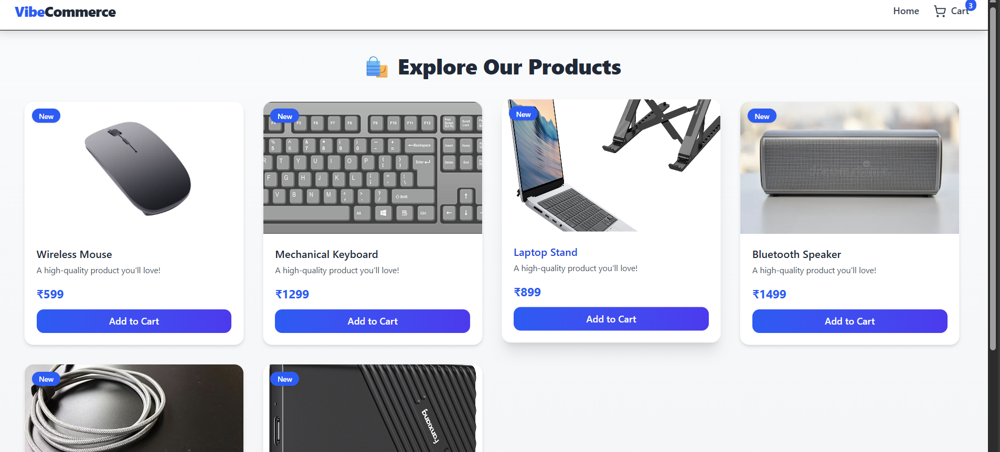

# 🛍️ VibeCommerce – Full Stack Mock E-Commerce Cart

### 🚀 Overview
A full-stack shopping cart app built as part of Vibe Commerce’s internship screening assignment.

Users can browse products, add/remove from cart, view totals, and complete a mock checkout (no real payments).

---

### 🧰 Tech Stack
- **Frontend:** React + TailwindCSS
- **Backend:** Node.js + Express
- **Database:** Mock (JSON)
- **APIs:** RESTful

---

### ⚙️ Features
- Product grid with "Add to Cart"
- Cart page (update, remove, total)
- Checkout form (name, email, address)
- Mock checkout with success receipt
- Responsive UI (TailwindCSS)
- Toast notifications
- Clean folder structure

---

### 🖥️ API Endpoints
| Method | Endpoint | Description |
|--------|-----------|-------------|
| GET | `/api/products` | Get all products |
| GET | `/api/cart` | Get current cart items |
| POST | `/api/cart` | Add product to cart |
| DELETE | `/api/cart/:id` | Remove product from cart |
| POST | `/api/checkout` | Mock checkout with receipt |

---

### 🧪 Setup Instructions
```bash
# Clone the repo
git clone https://github.com/<your-username>/vibe-commerce.git
cd vibe-commerce

# Start backend
cd backend
npm install
node index.js

# Start frontend
cd ../frontend
npm install
npm run dev

home page 
